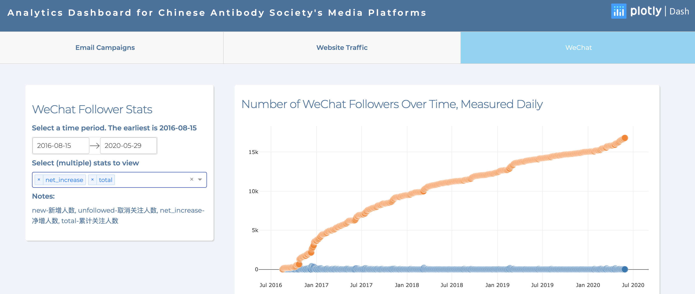
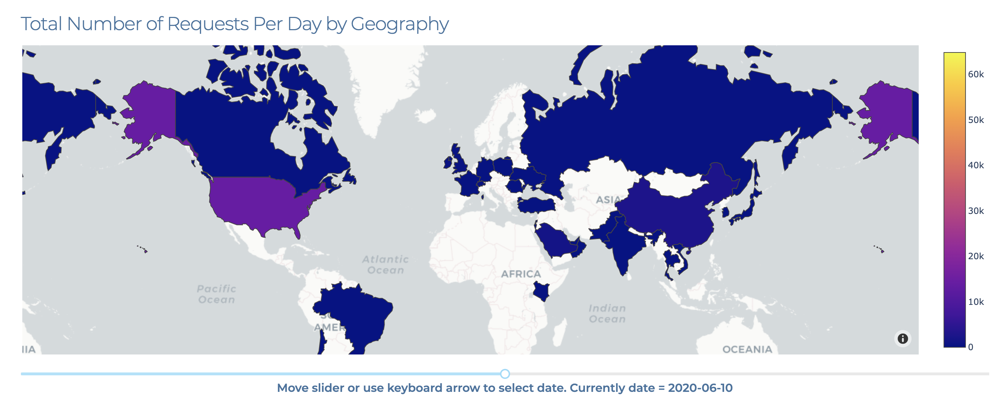

# cas-analytics-dashboard
A Analytics Dashboard built by Python Dash for Chinese Antibody Society's multimedia platforms

[View dashboard here](https://analytics.chineseantibody-dev.org/)

# Data Collection
All data collection was done through API except for WeChat (authorization for WeChat API requires a special type of account).

Note: 
- `data` folder is NOT included in the repository. 
- Certain API keys (e.g. mapbox) or sensitive data is hidden for security reasons. 

# Buil & Deployment
Built using Dash Plotly. Deployed on AWS Elastic Beanstalk

# Screenshots

